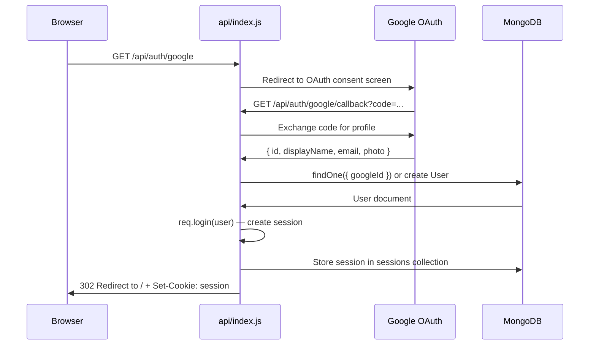
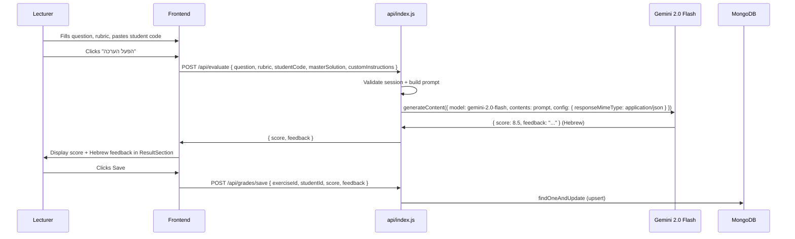
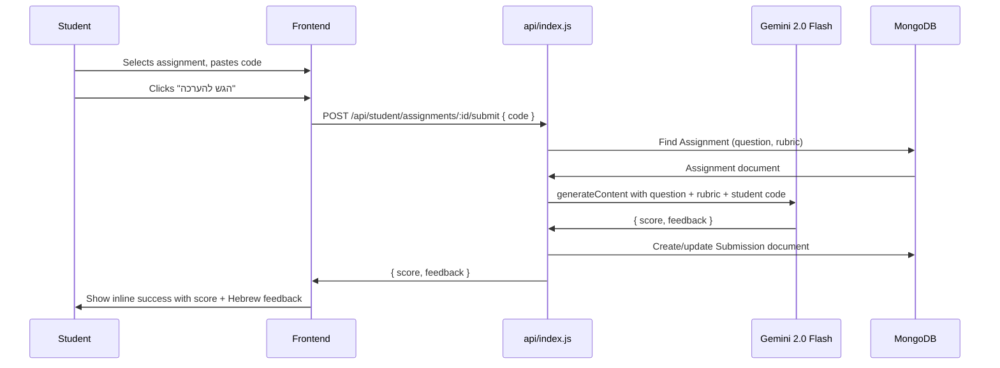
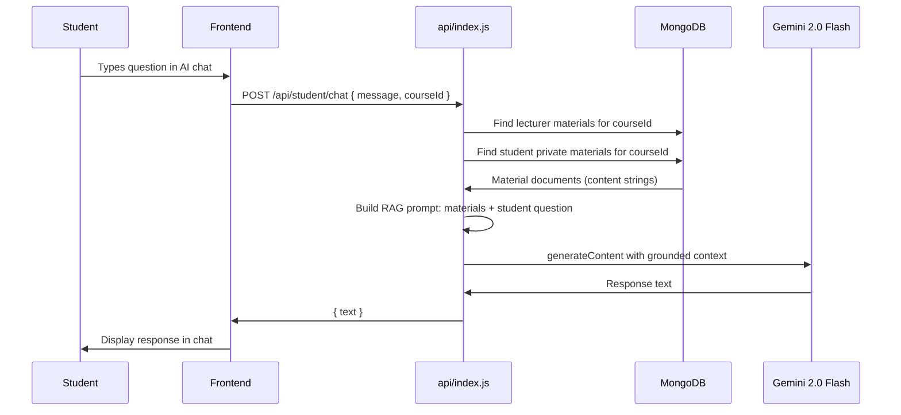
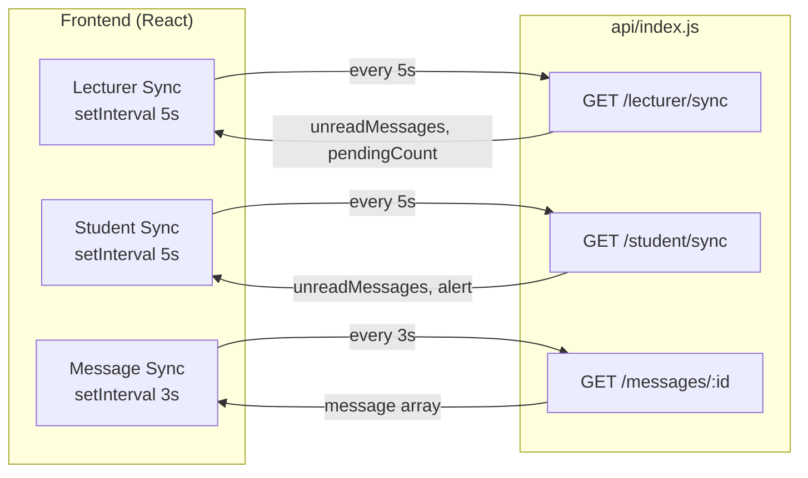

# ARCHITECTURE.md — ST System Technical Architecture

---

## 1. System Overview

ST System is a full-stack SaaS application built on a **decoupled architecture**: a React single-page application served from Vercel's Edge CDN communicates with a single Express.js serverless function that handles all backend logic — authentication, database access, and AI orchestration.

```
┌─────────────────────────────────────────────────────────────┐
│                        Browser                              │
│                                                             │
│   React 19 SPA (TypeScript + Tailwind CSS)                  │
│   ┌─────────────┐  ┌──────────────┐  ┌──────────────────┐  │
│   │ Lecturer    │  │ Student      │  │ Shared           │  │
│   │ Dashboard   │  │ Portal       │  │ Components       │  │
│   └─────────────┘  └──────────────┘  └──────────────────┘  │
│              │              │                               │
│              └──────────────┘                               │
│                     │                                       │
│              apiService.ts                                  │
└─────────────────────┼───────────────────────────────────────┘
                      │ HTTPS /api/*
┌─────────────────────▼───────────────────────────────────────┐
│                   Vercel Serverless                          │
│                                                             │
│   api/index.js  (Express.js + Passport.js)                  │
│   ┌──────────┐  ┌──────────┐  ┌──────────┐  ┌──────────┐  │
│   │  Auth    │  │ Courses  │  │   AI     │  │ Messages │  │
│   │  Routes  │  │ Routes   │  │  Routes  │  │  Routes  │  │
│   └──────────┘  └──────────┘  └──────────┘  └──────────┘  │
└──────┬──────────────┬────────────────┬────────────────────  ┘
       │              │                │
┌──────▼──────┐ ┌─────▼──────┐ ┌──────▼──────┐
│  MongoDB    │ │  Google    │ │  Gemini     │
│  Atlas      │ │  OAuth 2.0 │ │  2.0 Flash  │
└─────────────┘ └────────────┘ └─────────────┘
```

---

## 2. File Structure

```
st-system/
├── api/
│   └── index.js              # Entire backend: routes, models, auth, AI
├── components/
│   ├── Login.tsx             # Login screen (Google OAuth + dev bypass)
│   ├── RoleSelector.tsx      # First-login role selection
│   ├── LecturerDashboard.tsx # Main lecturer shell + nav
│   ├── StudentPortal.tsx     # Main student shell + nav
│   ├── InputSection.tsx      # Code editor + exercise tabs
│   ├── ResultSection.tsx     # AI evaluation result display
│   ├── GradeBook.tsx         # Spreadsheet-style gradebook
│   ├── CourseManager.tsx     # Course CRUD + Library Zone
│   ├── AssignmentManager.tsx # Assignment CRUD + submissions view
│   ├── StudentManagement.tsx # Waitlist approve/reject + history
│   ├── StudentAssignments.tsx# Student assignment list + submission form
│   ├── ArchiveViewer.tsx     # Gradebook snapshot list + restore
│   ├── ChatBot.tsx           # Floating AI assistant (lecturer + student)
│   └── DirectChat.tsx        # Direct messaging thread
├── services/
│   └── apiService.ts         # All frontend API calls (fetch wrappers)
├── App.tsx                   # Root component; auth routing
├── LecturerDashboard.tsx     # Lecturer view router (tab switching)
├── types.ts                  # TypeScript interfaces for all entities
├── constants.ts              # App-wide constants (TabOption enum, etc.)
├── index.html                # Entry HTML; loads Tailwind from CDN
├── vite.config.ts            # Vite config + /api proxy for local dev
├── vercel.json               # Vercel routing: /api/* → api/index.js
├── server.js                 # Standalone Express server (local dev only)
├── .env                      # Local environment variables (gitignored)
└── .env.example              # Template for environment variables
```

---

## 3. Data Flow Diagrams

### 3.1 Authentication Flow



### 3.2 AI Code Evaluation Flow



### 3.3 Student Assignment Submission Flow



### 3.4 RAG Student Chat Flow



### 3.5 Real-Time Polling Architecture



---

## 4. Database Schema

All Mongoose models are defined in `api/index.js`.

### User
```js
{
  googleId:         String  // unique; "dev-lecturer" / "dev-student" for dev users
  name:             String
  email:            String
  picture:          String  // Google profile photo URL
  role:             String  // enum: 'lecturer' | 'student'
  activeCourseId:   String  // currently selected course (students)
  enrolledCourseIds:[String] // course ObjectId strings
  pendingCourseIds: [String] // courses awaiting approval
  unseenApprovals:  Number  // badge counter
}
```

### Course
```js
{
  name:              String
  code:              String  // unique 6-char join code
  lecturerId:        String  // googleId of owner
  lecturerName:      String
  lecturerPicture:   String
  enrolledStudentIds:[String] // googleIds
  pendingStudentIds: [String] // googleIds
}
```

### Assignment
```js
{
  courseId:   String
  title:      String
  question:   String
  rubric:     String
  openDate:   Date
  dueDate:    Date
  createdAt:  Date  // default: now
}
```

### Submission
```js
{
  assignmentId:   String
  courseId:       String
  studentId:      String  // googleId
  code:           String
  score:          Number
  feedback:       String  // Hebrew
  status:         String  // enum: 'pending' | 'evaluated'
  timestamp:      Date    // default: now
  extensionUntil: Date    // optional; overrides assignment dueDate
}
```

### Material
```js
{
  courseId:   String
  title:      String
  content:    String
  type:       String  // 'lecturer_shared' | 'student_private'
  ownerId:    String  // googleId (for private materials)
  isVisible:  Boolean // default: true
  viewedBy:   [String] // googleIds
  fileName:   String
  fileType:   String
  fileSize:   Number
}
```

### DirectMessage
```js
{
  senderId:   String  // googleId
  receiverId: String  // googleId
  text:       String
  replyToId:  String  // optional; message ObjectId
  replyText:  String  // optional; preview of replied-to message
  isRead:     Boolean // default: false
  isEdited:   Boolean // default: false
  deletedFor: [String] // googleIds who deleted for themselves
  timestamp:  Date    // default: now
}
```

### Grade
```js
{
  userId:     String  // googleId of lecturer
  studentId:  String  // googleId
  exerciseId: String
  score:      Number
  feedback:   String
  timestamp:  Date    // default: now
}
```

### Archive
```js
{
  sessionName: String
  courseId:    String
  lecturerId:  String
  data:        Object  // full gradebook state snapshot
  stats:       Object  // { avgScore, distribution: { high, mid, low } }
  timestamp:   Date    // default: now
}
```

### WaitlistHistory
```js
{
  studentId:  String  // googleId
  courseId:   String
  courseName: String
  status:     String  // enum: 'approved' | 'rejected'
  timestamp:  Date    // default: now
}
```

---

## 5. API Layer

The entire backend is a single Express app mounted in `api/index.js`. On Vercel, this file is the serverless function handler. All routes are registered on an Express `Router` which is mounted at `/api` via `vercel.json`.

```json
// vercel.json
{
  "rewrites": [{ "source": "/api/(.*)", "destination": "/api/index.js" }]
}
```

**Connection pooling:** The `connectDB()` helper checks `mongoose.connection.readyState` before connecting, reusing the existing socket across serverless invocations in the same execution context.

**Route security pattern:**
```js
// Unauthenticated
router.get('/auth/me', ...)

// Any authenticated user
router.post('/grades/save', async (req, res) => {
  if (!req.user) return res.status(401).send();
  ...
})

// Lecturer only
router.post('/lecturer/courses', async (req, res) => {
  if (!req.user || req.user.role !== 'lecturer') return res.status(401).send();
  ...
})
```

---

## 6. Security Model

### Authentication
- **Google OAuth 2.0** via Passport.js. No passwords are stored.
- Sessions are serialized by MongoDB `_id` and stored in the `sessions` collection via `connect-mongo`.
- The `GOOGLE_CALLBACK_URL` env var allows the callback URL to be overridden per environment (absolute URL for local dev; relative path falls back for production).

### Secret Protection
- `GEMINI_API_KEY`, `GOOGLE_CLIENT_SECRET`, and `SESSION_SECRET` are stored exclusively in environment variables.
- The frontend **never** calls Google or Gemini directly — all AI requests are proxied through the backend.
- `.env` is listed in `.gitignore` and never committed.

### Role Isolation
- All `/lecturer/*` routes check `req.user.role === 'lecturer'`.
- Student routes check `req.user.role === 'student'` or simply `req.user`.
- Students cannot access course data for courses they are not enrolled in.

### Session Security
- Cookies are `httpOnly` and `secure` in production (`NODE_ENV === 'production'`).
- `sameSite: 'lax'` protects against CSRF for most use cases.
- Sessions expire after 7 days of inactivity.

---

## 7. Frontend Architecture

### State Management
No external state management library (no Redux, no Zustand). State is managed with React `useState` and `useEffect` hooks at the component level, with data passed down as props.

### Data Fetching
All API calls go through `services/apiService.ts`, a plain object of `async` functions wrapping `fetch`. Errors are thrown from `handleResponse()` and caught inline in components.

### Routing
No client-side router (no React Router). Navigation between views is handled by a `viewMode` state string in `LecturerDashboard.tsx` and `StudentPortal.tsx`. The app is a true SPA with a single URL.

### Styling
Tailwind CSS is loaded from CDN in `index.html`. No `tailwind.config.js` — custom colors (`brand-*`) are defined inline in the CDN URL. Dark mode is toggled by adding/removing the `dark` class on `document.documentElement`.

---

## 8. Deployment Architecture

```
GitHub main branch
       │
       │ push / merge
       ▼
Vercel CI/CD
       │
       ├─── Build: vite build → dist/
       │    (React SPA → static assets)
       │
       ├─── Deploy: dist/ → Vercel Edge CDN (global)
       │
       └─── Serverless: api/index.js → Vercel Function
                        (runs in region nearest to MongoDB Atlas)
```

**Local development:**
```
npm run dev          → Vite on :5173 (frontend)
node server.js       → Express on :3000 (backend)
vite.config.ts proxy → /api/* → :3000
```
