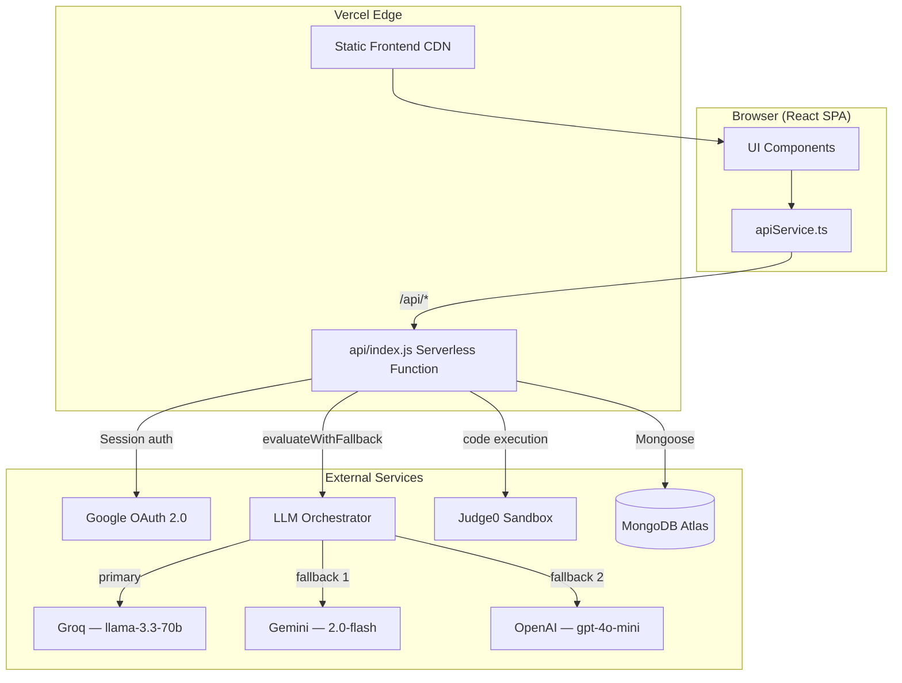

# CHAM Agent — AI Code Grader


A full-stack academic platform for automated code evaluation, course management, and student-lecturer communication — powered by multi-provider AI (Groq/Gemini/OpenAI) with Hebrew pedagogical feedback, prompt injection protection, and intelligent fallback routing.

**Live:** [stsystem.vercel.app](https://stsystem.vercel.app)

---

## Table of Contents

- [Overview](#overview)
- [Features](#features)
- [Tech Stack](#tech-stack)
- [Architecture](#architecture)
- [Security](#security)
- [Installation](#installation)
- [Environment Variables](#environment-variables)
- [API Reference](#api-reference)
- [Deployment](#deployment)
- [Roadmap](#roadmap)

---

## Overview

Lecturers define exercises with rubrics and master solutions; students submit code; the AI evaluation engine evaluates submissions and returns detailed pedagogical feedback in Hebrew.

The system implements the **CHAM (Contextual Hybrid Assessment Model)** — a three-layer assessment pipeline combining Judge0 sandbox execution, multi-provider LLM semantic analysis, and human review routing for low-confidence cases. The full course lifecycle is covered: enrollment, material sharing, assignment management, AI grading, gradebook, real-time messaging, and archiving.

---

## Features

### Lecturer

- **Course Management** — Create courses with unique join codes; edit or delete courses
- **Student Enrollment** — Approve or reject students from a waitlist; remove enrolled students
- **Library Zone** — Upload and manage course materials (text/PDF); control visibility per student
- **AI Grading Engine** — Submit a question, master solution, rubric, and student code; receive a score (0–10) and detailed Hebrew feedback via multi-provider LLM (Groq → Gemini → OpenAI fallback) with prompt injection protection
- **Custom AI Constraints** — Add freeform instructions enforced during evaluation (e.g. "Penalize use of global variables")
- **Assignment Manager** — Create timed assignments with open/due dates; grant per-student deadline extensions; manual submission with full CHAM pipeline
- **Deductions** — Structured code-quoted deductions with Hebrew labels, RTL layout, and expandable previews
- **Feedback Release** — Control when students can see their evaluation results
- **Gradebook** — Spreadsheet-style grid for managing scores and feedback across the class; export to Hebrew-encoded CSV
- **Archive Zone** — Save and restore full gradebook snapshots with class statistics
- **Direct Messaging** — Real-time messaging with any student; reply, edit, and delete messages
- **Notifications** — Unread message badges via 5-second polling

### Student

- **Course Enrollment** — Request to join any course via its 6-character code
- **Course Materials** — View all lecturer-shared documents; mark materials as read
- **Private Vault** — Upload personal study files used as context by the AI study assistant
- **Assignment Submission** — Submit code for open assignments; receive instant AI evaluation with score and Hebrew feedback
- **Evaluation History** — Review all past submissions, scores, and feedback
- **AI Study Assistant** — RAG-powered chatbot grounded in course materials and the student's private vault
- **Direct Messaging** — Message the lecturer or fellow enrolled students
- **Multi-Course Support** — Enroll in multiple courses and switch between them

---

## Tech Stack

| Layer | Technology | Notes |
|---|---|---|
| Frontend | React 19 + TypeScript | Vite build tool |
| Styling | Tailwind CSS | Loaded from CDN |
| Backend | Express.js | Single Vercel Serverless Function (`api/index.js`) |
| Database | MongoDB Atlas + Mongoose | All models in `api/index.js` |
| AI | Groq / Gemini / OpenAI | Multi-provider fallback via `LLMOrchestrator`; server-side only |
| Security | Prompt injection defense + rate limiting | `promptGuard.js` + `express-rate-limit` |
| Code Sandbox | Judge0 | Network-disabled, 5s CPU limit |
| Auth | Google OAuth 2.0 + Passport.js | Sessions via `express-session` + `connect-mongo` |
| Real-time | HTTP Polling (5s) | No WebSockets; serverless-compatible |
| Deployment | Vercel | Frontend on Edge CDN; backend as serverless function |

---

## Architecture



**Evaluation request flow:**

1. Lecturer submits question + rubric + student code
2. `apiService.ts` posts to `POST /api/evaluate` (rate-limited: 100 req/hr)
3. `api/index.js` validates the session and runs `buildSafePrompt()` for injection detection
4. `LLMOrchestrator.evaluateWithFallback()` tries Groq → Gemini → OpenAI (each with internal fallback on 429)
5. `validateLLMOutput()` enforces score ranges (0–100) and required fields; low-confidence, injection-flagged, or anomalous results are routed to human review via `smartRouting.js`
6. Result returned to frontend; `ResultSection` renders the score and Hebrew feedback

---

## Security

**Deep dive: how the grader defends against prompt injection** → [docs/PROMPT_INJECTION_DEFENSE.md](docs/PROMPT_INJECTION_DEFENSE.md)

### Protections (v2.1.1)

- **Prompt Injection Defense** — 21-pattern detection via `promptGuard.js`; all user inputs sanitized before LLM submission via `buildSafePrompt()`
- **Output Validation** — Score ranges (0–100) and required-field checks enforced via `validateLLMOutput()`; `safeParseLLMResponse()` parses defensively and fails closed on non-conforming replies
- **Code Sandbox Isolation** — Judge0 with network disabled, 5s CPU limit; execution result provides a ground-truth correctness signal independent of the LLM
- **Rate Limiting** — `POST /evaluate`: 100 req/hr; submissions: 20/15 min; uploads: 60/hr; chat: 30/hr
- **RBAC + Ownership Checks** — Lecturers can only modify their own assignments and materials; students isolated by course enrollment; ownership verified before read/write/delete on all assignment and material routes (v2.1.1)
- **Session Security** — Google OAuth 2.0 with Passport.js; session secrets signed; no sensitive data in cookies; dev-login bypass disabled in production

### Recent fixes (2026-05-21, v2.1.1)

Two findings from the internal security audit:

- **CRITICAL-1**: Added rate limiting to `POST /grades/save` (prevents DB flooding)
- **CRITICAL-2**: Enforced ownership checks on 9 assignment/material routes (prevents cross-lecturer IDOR)

Full audit details: [docs/audits/weekly-audit-2026-05-21.md](docs/audits/weekly-audit-2026-05-21.md)

---

## Installation

**1. Clone**

```bash
git clone https://github.com/Oratias07/CHAM-Agent.git
cd CHAM-Agent
```

**2. Install dependencies**

```bash
npm install
```

**3. Configure environment variables**

```bash
cp .env.example .env
# fill in all values — see Environment Variables below
```

**4. Set up Google OAuth**

In [Google Cloud Console](https://console.cloud.google.com/) → APIs & Services → Credentials, create an OAuth 2.0 Client ID and add the following authorized redirect URIs:

```
http://localhost:3000/api/auth/google/callback
https://your-domain.vercel.app/api/auth/google/callback
```

**5. Start the backend**

The backend is a Vercel Serverless Function (`api/index.js`) — there is no standalone Express server. Run it locally with the Vercel CLI:

```bash
npm i -g vercel   # one-time install
vercel dev        # serves /api on http://localhost:3000
```

**6. Start the frontend**

In a second terminal:

```bash
npm run dev
# Vite starts on http://localhost:5173; /api/* proxied to port 3000
```

Use the **Developer Bypass** on the login screen to sign in without Google OAuth during local development.

---

## Environment Variables

| Variable | Required | Description |
|---|---|---|
| `MONGODB_URI` | Yes | MongoDB Atlas connection string |
| `GOOGLE_CLIENT_ID` | Yes | OAuth 2.0 Client ID |
| `GOOGLE_CLIENT_SECRET` | Yes | OAuth 2.0 Client Secret |
| `GOOGLE_CALLBACK_URL` | Local only | `http://localhost:3000/api/auth/google/callback` — omit in production |
| `SESSION_SECRET` | Yes | Long random string for signing session cookies |
| `GEMINI_API_KEY` | Yes | From [Google AI Studio](https://aistudio.google.com/app/apikey) |
| `GROQ_API_KEY` | Optional | Primary LLM provider; free tier at console.groq.com |
| `OPENAI_API_KEY` | Optional | Last-resort fallback provider |
| `LLM_PROVIDER_ORDER` | Optional | Default: `groq,gemini,openai` |
| `JUDGE0_API_URL` | Optional | Sandbox URL for code execution |
| `JUDGE0_API_KEY` | Optional | Sandbox auth key |
| `DEV_PASSCODE` | Optional | Dev login bypass (disabled in production) |

---

## API Reference

All endpoints are prefixed with `/api`. All routes except auth require a valid session cookie.

### Authentication

| Method | Route | Auth | Description |
|---|---|---|---|
| `GET` | `/auth/me` | None | Get current authenticated user |
| `GET` | `/auth/google` | None | Initiate Google OAuth flow |
| `GET` | `/auth/google/callback` | None | OAuth callback |
| `GET` | `/auth/logout` | None | Destroy session |
| `POST` | `/auth/dev` | None | Dev bypass. Body: `{ role: "lecturer" \| "student" }` |

### Lecturer — Courses

| Method | Route | Auth | Description |
|---|---|---|---|
| `POST` | `/lecturer/courses` | Lecturer | Create a course. Body: `{ name, code }` |
| `PUT` | `/lecturer/courses/:id` | Lecturer | Update course |
| `DELETE` | `/lecturer/courses/:id` | Lecturer | Delete course and its materials |
| `GET` | `/lecturer/courses/:id/waitlist` | Lecturer | Pending and enrolled students |
| `POST` | `/lecturer/courses/:id/approve` | Lecturer | Approve student. Body: `{ studentId }` |
| `POST` | `/lecturer/courses/:id/reject` | Lecturer | Reject student. Body: `{ studentId }` |
| `POST` | `/lecturer/courses/:id/remove-student` | Lecturer | Remove enrolled student |
| `GET` | `/lecturer/courses/:id/all-submissions` | Lecturer | All evaluated submissions for a course |

### Lecturer — Assignments

| Method | Route | Auth | Description |
|---|---|---|---|
| `POST` | `/lecturer/assignments` | Lecturer | Create assignment. Body: `{ courseId, title, question, rubric, openDate, dueDate }` |
| `GET` | `/lecturer/courses/:courseId/assignments` | Lecturer | List assignments |
| `PUT` | `/lecturer/assignments/:id` | Lecturer | Update assignment |
| `DELETE` | `/lecturer/assignments/:id` | Lecturer | Delete assignment |
| `GET` | `/lecturer/assignments/:id/submissions` | Lecturer | All student submissions |
| `POST` | `/lecturer/submissions/:id/extension` | Lecturer | Grant deadline extension. Body: `{ extensionUntil }` |
| `POST` | `/lecturer/assignments/:id/submit-manual` | Lecturer | Manual submission with full CHAM pipeline. Body: `{ studentId, code, language }` |
| `POST` | `/lecturer/assignments/:id/release-feedback` | Lecturer | Release feedback to all students |

### Lecturer — Gradebook

| Method | Route | Auth | Description |
|---|---|---|---|
| `POST` | `/grades/save` | Session | Save grade. Body: `{ exerciseId, studentId, score, feedback }` |
| `GET` | `/grades` | Session | All grade entries for current user |
| `POST` | `/lecturer/archive` | Lecturer | Save gradebook snapshot. Body: `{ sessionName, data, stats }` |

### AI

| Method | Route | Auth | Description |
|---|---|---|---|
| `POST` | `/evaluate` | Session | Run AI code evaluation. Body: `{ question, masterSolution, rubric, studentCode, customInstructions }`. Returns `{ score, feedback }` |
| `POST` | `/chat` | Session | Lecturer AI assistant. Body: `{ message, context }` |

### Student

| Method | Route | Auth | Description |
|---|---|---|---|
| `POST` | `/student/join-course` | Student | Request to join. Body: `{ code }` |
| `GET` | `/student/sync` | Student | Poll for messages, notifications, approval alerts |
| `GET` | `/student/submissions` | Student | Personal submission history |
| `GET` | `/student/courses/:courseId/materials` | Student | Lecturer-shared and personal materials |
| `POST` | `/student/private-materials` | Student | Upload to Private Vault |
| `GET` | `/student/courses/:courseId/assignments` | Student | Assignments and personal submissions |
| `POST` | `/student/assignments/:id/submit` | Student | Submit code. Body: `{ code }`. Returns `{ score, feedback }` |
| `POST` | `/student/chat` | Student | RAG study assistant. Body: `{ message, courseId }` |

### Messages

| Method | Route | Auth | Description |
|---|---|---|---|
| `GET` | `/messages/:otherId` | Session | Conversation thread |
| `POST` | `/messages` | Session | Send message. Body: `{ receiverId, text, replyToId?, replyText? }` |
| `PUT` | `/messages/:id` | Session | Edit own message |
| `DELETE` | `/messages/:id` | Session | Delete message. Query: `?forEveryone=true\|false` |

---

## Deployment

**Deploy to Vercel:**

1. Push to GitHub and import in [Vercel Dashboard](https://vercel.com/new)
2. Set all environment variables under Settings → Environment Variables (do not set `GOOGLE_CALLBACK_URL` or `DEV_PASSCODE` in production)
3. Add the production OAuth callback URL in Google Cloud Console: `https://your-project.vercel.app/api/auth/google/callback`
4. In MongoDB Atlas → Network Access, add `0.0.0.0/0` to allow Vercel's dynamic IPs

---

## Roadmap

**Recently completed**
- Multi-provider LLM fallback via `LLMOrchestrator`
- Prompt injection protection on all LLM call sites
- Safe JSON parsing and LLM output validation
- IDOR prevention and rate limiting across all write routes (v2.1.1)
- Prompt version tracking

**Planned (Phase 1)**
- Async task queue (BullMQ + Redis) for background evaluation jobs
- Response caching keyed by `SHA-256(code + rubric + prompt_version)`
- Dedicated audit trail collection
- Appeal mechanism ("Request Human Review")

**Planned (Phase 2+)**
- WebSocket messaging (replace polling)
- Plagiarism detection via code embeddings
- LTI 1.3 integration (Moodle/Canvas)

---

## License

MIT © Or Atias
